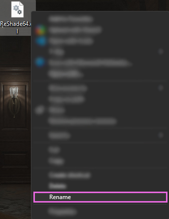
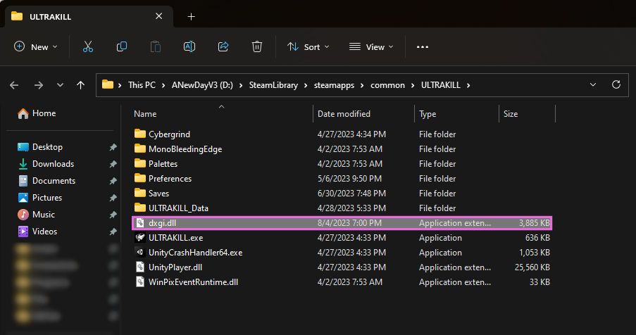
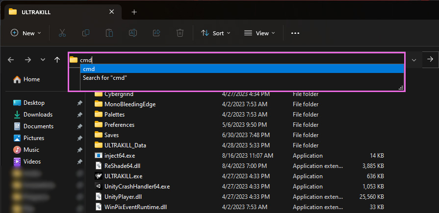

# ReShade Manual Installation Guides

Some games might not support the standard automated install process of the ReShade Installer due to permission constraints, improper administrative privileges, or even missing user dependencies.

The guides below aim to help users understand and navigate the processes required to manually install ReShade and get past some of these contraints.

---

Installing ReShade Manually

{: note }
When manually installing ReShade, you have to manually install shaders as well.

### Step 1: Identify Your Game's Architecture

1. Navigate to [PCGamingWiki](https://www.pcgamingwiki.com/wiki/Home).
2. Use the search bar to find your game.
   
3. Locate the API tab on your game's page, typically towards the end.
   

---
 
### Step 2: Download the ReShade Installer

- Download the latest ReShade installer from the [official ReShade website](https://reshade.me).

---

### Step 3: Download and Install `7Zip`

1. Download and install the latest `.msi` version of `7Zip` from [7Zip's official website](https://www.7-zip.org/download.html).
   

   {: .note} 
   While WinRar can be an alternative, this guide focuses on using `7Zip`.

---
 
### Step 4: Extract ReShade Binary

1. Right-click on the ReShade Installer `ReShade_Setup_x.x.x.exe`, hover over `7Zip`, and select `Open Archive`.
   
2. Choose the necessary DLL from the options:
>    - `ReShade64.dll` for 64-Bit
>    - `ReShade32.dll` for 32-Bit
   

---
 
### Step 5: Rename the Binary

Right-click the `ReShadeXX.dll` you've extracted and choose `Rename`. Then, rename it according to your game's rendering API:

> - **dxgi.dll** - DirectX 10/11/12
> - **d3d12.dll** - DirectX 12
> - **d3d11.dll** - DirectX 11
> - **d3d10.dll** - DirectX 10
> - **d3d9.dll** - DirectX 9
> - **opengl32.dll** - OpenGL

---
 
### Step 6: Move the Renamed DLL

1. Position the renamed DLL into the root folder of your game, the same directory where the game's executable is located.
   
      2. If unsure of your game's executable location, consult [our guide on identifying your game's executable](https://guides.martysmods.com/docs/special_other/finding_your_game_executable.html).

Upon completion, your game should launch with ReShade already integrated!

------

How to Manually Inject ReShade

Certain games do not support automatic ReShade injection during runtime. 
This is especially common for UWP (Microsoft Store) games, which often disallow automatic injection. 

Thankfully, Crosire has developed a tool for manual DLL injection into games.

{: note }
When manually injecting ReShade using Crosire's Inject Tool, you have to manually install shaders as well.

{: .warning} 
Crosire's Inject tool, being an external injector, is more likely to trigger anti-cheat systems. **Use with caution and at your own risk**.

---

## Step 1: Determine Your Game's Architecture

1. Go to [PCGamingWiki](https://www.pcgamingwiki.com/wiki/Home).
2. Enter your game's name in the search bar.
   
3. Proceed to the API section on your game's page (usually located towards the end).
   

---

### Step 2: Download the Right Injector

Choose the injector based on your game's architecture:
* [64-bit Injector](https://reshade.me/downloads/inject64.exe)
* [32-bit Injector](https://reshade.me/downloads/inject32.exe)

---

### Step 3: Download ReShade Installer

Acquire the latest ReShade Installer from the [ReShade website](https://www.reshade.me).

---

### Step 4: Get `7Zip`

1. Download and install the latest `.msi` version from [7Zip's official website](https://www.7-zip.org/download.html).
   

{: .note} 
`WinRar` can serve as an alternative, but this guide utilizes `7Zip`.

---

### Step 5: Extract ReShade Binary

1. Right-click the ReShade Installer `ReShade_Setup_x.x.x.exe`, hover over `7Zip`, and select `Open Archive`.
   
2. Extract the desired DLL:
   - `ReShade64.dll` for 64-Bit
   - `ReShade32.dll` for 32-Bit
   

{: .note}
The DLL architecture should match the injector you've previously downloaded.

---

### Step 6: Position the Files

Move both the `injectXX.exe` and `ReShadeXX.dll` files to your game directory.

For assistance locating your game directory, see [our guide on finding your game's executable](https://guides.martysmods.com/docs/special_other/finding_your_game_executable.html).

---

### Step 7: Identify the Game Process Name

1. Launch the desired game.
2. Open Task Manager and right-click on your game under the processes tab, then select `Go to Details`.
   
3. The highlighted executable displays the game's process name.
   

---

### Step 8: Inject ReShade

1. Close your game.
2. Navigate to your game's directory and open a command prompt by typing `CMD` into File Explorer's address bar.
   
3. Input `inject[x32/x64].exe "name_of_the_process.exe"` and hit Enter.
   
4. Open your game.

If executed correctly, ReShade should be active once the game begins.

---

Manually Installing Shaders for ReShade

This guide will go over how to install ReShade shaders manually without having to run the ReShade Installer!

{: warning }
This guide assumes that you already have ReShade installed!

---

### Step 1: Create a reshade-shaders Folder

1. Navigate to your game directory.

   - If unsure of your game's executable location, consult [our guide on identifying your game's executable](https://guides.martysmods.com/docs/special_other/finding_your_game_executable.html).

2. Create a `reshade-shaders` folder in the same location as your ReShade binary and enter the `reshade-shaders` folder.

3. Create two new folders within `reshade-shaders` called:

   * `Shaders`

   * `Textures`

### Step 2: Download the Shader Repository(s) Required

{: note }
This guide will be utilizing the iMMERSE repository on GitHub, however, you can utilize any shader repository for this guide. 

Skip this portion of the guide if you already have the shader repositories already downloaded.

1. Navigate to the GitHub repository of your choice.

   * Notice the green `<> Code` bottom above the files that are listed in the main directory of the shader repository.

2. Click the green `<> Code` button

   * Notice the dropdown that is now displayed, and the `Download ZIP` button that is within.

3. Click the `Download ZIP` button in the `<> Code` dropdown.

   * This will download an archive of the shader repository from that GitHub site.

### Step 3: Open the Shader Repository Archive and Move the Shader Files to the Proper Location

1. Open up the `reshade-shaders` folder that you created in Step 1.

2. Open up the shader repository that you have downloaded in Step 2.

3. Copy the `Shaders` and `Textures` folders from the shader repository archive, and place them into the `reshade-shaders` folder.

   * Remember that not every shader repository will have the same structured layout, you might have to dig deeper, collect the shader and texture files manually , or place the shaders and their textures manually within the `reshade-shaders\Shaders` and `reshade-shaders\Textures` folders.

### Step 4: Setting ReShade to Look in the Proper Location for Shader and Texture Folders.

1. Launch your game.

2. Open ReShade and navigate to the `Settings` tab.

3. Locate the `Effect Search Path` and `Texture Search Path` arguments

   * If you are starting with a fresh install of ReShade from a manual install, this area should be blank

4. Add the following paths to the arguments

   * `.\reshade-shaders\Shaders\**`- Goes in the arguments for `Effect Search Path`

   * `.\reshade-shaders\Textures\**`- Goes in the arguments for `Texture Search Path`

{: note }
If you do not have a free slot to add a search path for, you can click the `+` icon located directly under the search paths!

5. Switch to the `Home` tab of ReShade, and click the `Reload` button at the bottom.

   * Once done, you should see your shaders then pop in the techniques area of the ReShade `Home` tab. 

