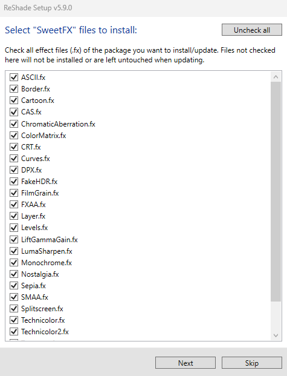
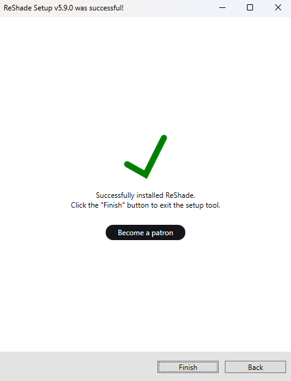

# ReShade Guides

ReShade is a post processing shader-injection that spans across all games and applications supporting DirectX 9-12, OpenGL, and Vulkan graphics rendering APIs. 

Similar to utilities like ENB, DXVK, or ASILoader, it integrates seamlessly with your game by injecting through the rendering API of your game, and unlocks an expansive range of visual customization options for you to customize your game with.

This guide seeks to demystify the ReShade installation process, easing your journey into its basic and advanced features!

---

Downloading the ReShade Installer

Start by grabbing the latest version of ReShade from the [official website](https://reshade.me/#download).

{: .warning }
Only download ReShade from its official site. Third-party sources can host malicious files and various attrocities, so **be vigilant**!

Once you are on the official ReShade website, scroll to the bottom portion that showcases the latest versions available for download.

You'll notice two distinct ReShade builds:

---

## Standard ReShade Build (Download ReShade x.x.x)

The Standard ReShade Build is designed for online games with stringent anti-cheat mechanisms. 

If you play online games like Dead by Daylight, PUBG, or Apex Legends, this is going to be your go-to build.

However, this build restricts some advanced features for compatibility with online games, such as disabling add-ons once a network connection has been detected in your game - This prevents bad actors from utilizing ReShade to cheat, and to inject code into their game.

---

## Full Add-On Support ReShade Build (Download ReShade x.x.x with full add-on support)

The Full Add-on Support ReShade Build is best suited for offline games or online games without robust anti-cheat systems.

If you play games like Final Fantasy XXIV, World of Warcraft, or Baldur's Gate 3, this will be the ReShade build for you!

This ReShade build supports the full spectrum of ReShade's features and add-ons, giving maximum creative freedom and allowing users to fully inject whatever they can think of into their game - most notibly being the user of Generic Depth for depth based shaders, like iMMERSE MXAO, iMMERSE Pro RTGI, or StageDepthPlus.

But remember, you can still be banned for using this version of ReShade in online games with anti-cheat solutions. Generally you will not get banned, but warned that you are injecting into the game before it starts up, but there are some systems that blanket ban for things, so it's worth staying cautious!

{: .warning }
Using shaders or add-ons to gain an unfair advantage in games is likely to get you banned. **Always play fair!**

---

Using the ReShade Installer

The guide written below will walk you through installing ReShade through the ReShade Installer.

This part can be hard for some, but it has been simplified for the majority of users!

---

Selecting Your Game

Once you have picked the proper installer for your type of game, run the launcher and you'll be prompted to select a game or application.

Here you will be able to select from options that are installed on your PC,

Alterantively, you can browse manually for your game executable, by selecting the `Browse...` button at the bottom, if it does not appear in the selection menu above.

The browse function allows you to specifically choose the executable that you are wanting to inject ReShade into. This feature is especially handy for games from platforms like itch.io, vintage games, or emulators like DOSBox and Dolphin.

{: .note }
If you are struggling to find your game's executable or game directory, you can follow our guide on [finding your game directory and executable](https://guides.martysmods.com/docs/special_other/finding_your_game_executable.html)!

---

Selecting the Rendering API

Rendering APIs like DirectX, Vulkan, or OpenGL are used by developers in order to send information to your computer hardware to draw, and for your computer hardware to then present on screen.

Each game will have their own rendering API to select, so it's crucial that you select the right one, otherwise ReShade will not be able to inject properly!

If you are unsure of what your rendering API is, platforms like the [PCGamingWiki](https://pcgamingwiki.com) can be helpful a helpful reference! However, if you want to take a crack at which API your game is without research, little notes about where each rendering API is generally choosen will be below:

---

DirectX 9 was prevalent from 2005 to 2012. There are an abundance of DirectX 9 titles that you can inject ReShade into - however, anything modern day is likely to be other rendering APIs.

---

DirectX 10-12 is common in engines like Unity and Unreal Engine. It's the safest bet for most modern games as it's the defacto standard for most graphics developers.

---

OpenGL is utilized by certain engines and older titles. If DirectX isn't an option and your game is not overhwelmingly dated, OpenGL is likely to be your answer.

---

Vulkan is popular in modern emulators and some newer game releases. For Linux users (using Wine or Proton), Vulkan is essential.

{: .important }
Vulkan installations request admin permissions due to certain system-level changes. Denying this might impair the ReShade installation.

---

Installing Presets

Installing presets has been made simple with the ReShade Installer, as the ReShade Installer is able to auto-detect the required shaders for selected presets, eliminating all the guesswork required in finding the shaders that you would need for each preset.

{: note }
If your preset requires unique shaders and textures outside the installer's offerings, you may need to install them manually.

To attach a preset, hit the `Browse...` button in the installer. All ReShade presets will be an `.ini` file. These files hold all the configurations that others have made to specific shaders, load orders, and hotkeys.

If you do not have a preset, you can skip this portion of the installer by simply hitting `Next`!

---

Installing Shaders with the ReShade Installer

Shaders are the driving force behind ReShade's versatility and power, as they are what allow users to craft unique visual experiences for each game.

Navigating to and sourcing shader collections can sometimes pose challenges since individual Shader Developers maintain their own storage and update methodologies. 

However, the ReShade installer simplifies this process for users.

If you've opted to install a preset with the preset installation page of the ReShade Installer, relevant shaders will be pre-selected in this section; otherwise, only `Standard Effects` will appear as marked.

In the shader installation section, two symbols represent installation options:

- A **square tick** indicates selective shader installation from a specific repository.

  

- A **check tick** ensures installation of all shaders from the chosen repository.

  

For information into individual Shader Developers and their repo, click on the blue-highlighted repository or author names. Doing so will redirect you to their online repository location, which often contains detailed shader information and descriptions beneficial for users.

After selecting the desired shaders, click on `Next.`

{: .note }
> Opting for the square tick for any shader repositories prompts the `Select {shader repository name} files to install` screen. 
> 
> From here, pick your preferred shaders and proceed by clicking `Next.`

---

Concluding the Installation Process

Upon completing the ReShade installation, a confirmation screen will indicate a successful installation.

Click `Finish` and initiate your game launch.

If installed correctly, ReShade will display an in-game banner:

If you come up with issues here, the most common issue is the wrong API or executable was selected!

