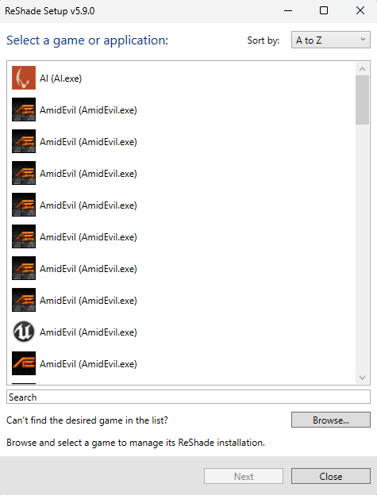
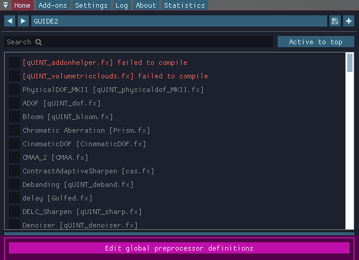
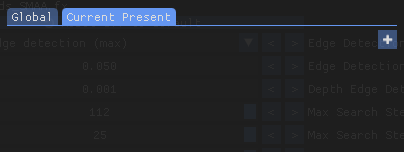
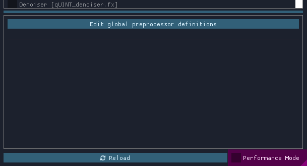
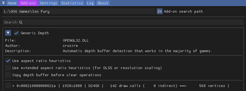
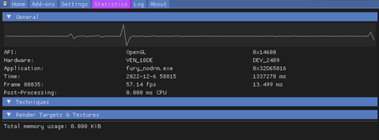
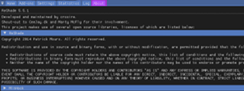

# ReShade

ReShade offers dynamic shader-injection across all games and applications supporting DirectX 9-12, OpenGL, and Vulkan graphics rendering APIs. Similar to utilities like ENB, DXVK, or ASILoader, it integrates seamlessly with your game, unlocking an expansive range of visual customization options. 

This guide demystifies the ReShade installation process, easing your journey into its basic and advanced features.

---

Downloading the ReShade Installer

Start by grabbing the latest version of ReShade from the [official website](https://reshade.me/#download).

Once on the site, scroll to the section showcasing the latest versions available for download.

You'll notice two distinct ReShade builds:

{: .warning }
Only download ReShade from its official site: [https://reshade.me](https://reshade.me). Third-party sources can host malicious files, so **be vigilant**!

---

## Standard ReShade Build (Download ReShade x.x.x)

Designed for online games with stringent anti-cheat mechanisms. 

If you play online games like Dead by Daylight, PUBG, or Apex Legends, this is your go-to build.

Notably, this build restricts some advanced features for compatibility such as add-ons and Generic Depth once a network connection has been detected in your game.

---

## Full Add-On Support ReShade Build (Download ReShade x.x.x with full add-on support)

Best suited for offline games or those without robust anti-cheat systems.

This ReShade build supports the full spectrum of ReShade's features and add-ons, giving maximum creative freedom. 

But remember, avoid using it on online games where graphical injections might be flagged.

{: .warning }
Using effects or add-ons to gain an unfair advantage in games is likely to get you banned. Always play fair!

---

Using the ReShade Installer

This guide will focus on getting you through the ReShade Installer.

This part can be hard for some, but it has been simplified for the majority of users!

Selecting Your Game

Launching the installer, you're prompted to select a game or application for ReShade installation. 

You should make yourself somewhat familiar with the ReShade Installer's various options for you to choose:

In the list above should be most, if not all, the games that you have installed on your machine currently.

However, if you are struggling to find your game, the ReShade Installer has a `Browse...` open for you to utilize.

This option allows you to specifically choose the executable that you are wanting to inject ReShade into.

This feature is especially handy for games from platforms like itch.io, vintage games, or emulators like DOSBox and Dolphin. 

{: .note }
If you are struggling to find your game's executable or game directory, you can follow our guide on [finding your game directory and executable](https://guides.martysmods.com/docs/special_other/finding_your_game_executable.html)!

Selecting the Rendering API

This step is crucial! 

Ensure you pick the correct rendering API for your game. 

Unsure? Platforms like Steam or [PCGamingWiki](https://pcgamingwiki.com) can be helpful references.

{: .important }
Selecting an incorrect API will result in ReShade not being able to properly inject into your game!

---

DirectX 9 was prevalent from 2005 to 2012. Modern titles often prefer newer versions.

---

DirectX 10-12 is common in engines like Unity and Unreal Engine. It's the safest bet for most modern games.

---

OpenGL is utilized by certain engines and older titles. If DirectX isn't an option and your game isn't too dated, OpenGL might be your answer.

---

Vulkan is popular in modern emulators and some newer game releases. For Linux users (using Wine or Proton), Vulkan is essential.

{: .important }
Vulkan installations request admin permissions due to certain system-level changes. Denying this might impair the ReShade installation.

Installing Presets

Installing presets is a breeze with the ReShade installer! 

The ReShade Installer is able to auto-detect the required shaders for selected presets, eliminating guesswork.

However, if your preset demands unique shaders and textures outside the installer's offerings, you may need to install them manually.

To attach a preset, hit the `Browse...` button in the installer.

If you do not have, or need a preset, you can skip this portion of the installer by simply hitting `Next`!

{: .note }
Look for `.ini` files representing ReShade presets.

Installing Shaders with the ReShade Installer

Shaders are the driving force behind ReShade's versatility, allowing users to craft unique visual experiences for each game.

Navigating to and sourcing shader collections can sometimes pose challenges since individual Shader Developers maintain their own storage and update methodologies. 

However, the ReShade installer simplifies this process for users.

If you've opted to install a preset with the preset installation page of the ReShade Installer, relevant shaders will be pre-selected in this section; otherwise, only `Standard Effects` will appear as marked.

In the shader installation section, two symbols represent installation options:

- A **square tick** indicates selective shader installation from a specific repository.
- A **check tick** ensures installation of all shaders from the chosen repository.

For insights into individual shader developers, click on the blue-highlighted repository or author names. 

This action will redirect you to their repository, which often contains detailed shader information and descriptions beneficial for users.

After selecting the desired shaders, click on `Next.`

{: .note }
> Opting for the square tick for any shader repositories prompts the `Select {shader repository name} files to install` screen. 
> 
> From here, pick your preferred shaders and proceed by clicking `Next.`

Concluding the Installation Process

Upon completing the ReShade installation, a confirmation screen will indicate a successful installation.

Click `Finish` and initiate your game launch.

If installed correctly, ReShade will display an in-game banner:

---

# Understanding ReShade's UI

After successfully installing ReShade, launch the game. 

If the ReShade popup appears at the screen's top, great! You're 70% done. Otherwise, revisit the renderer settings. 

To fully harness ReShade's power, familiarize yourself with its UI. Press the `HOME` key (or `POS1` on some keyboards depending on locale) to access the on-screen tutorial. 

First-timers, don't skip it! However, if you've bypassed it, let's explore each feature together. A proper understanding here will benefit you later, especially when diving into the Depth Buffer.

---

The Home Tab

ReShade's Home tab is a crucial hub, packed with valuable configurations awaiting exploration.

Current Preset

The section highlighted above indicates the active preset in ReShade. 

By default, presets are saved in the game directory, named `ReShadePreset.ini`. 

Use the `+` to create a new preset, the diskette icon to save, and arrows to switch between them. 

ReShade smartly identifies which `.ini` files are presets, ensuring seamless user experience.

Effect List

The highlighted segment above displays ReShade's Effect List within the Home tab. 

This section showcases all installed shaders. 

The list's size varies depending on the preset you've chosen and the effect packs you set up with ReShade.

Global Pre-processor Definitions

The above spotlight reveals the `Edit Global Preprocessor Definitions` button. 

Pre-Processor definitions act as toggles directing effects' behavior pre-loading. 

Adjustments here can influence shader functionality or compatibility. Clicking this button unveils a small window:

The primary tab displays `Global` definitions, applied to every preset. 

Though ReShade sets some defaults, users can add, edit, or remove them using the `+` and `-` signs. 

It is always good to know the pre-processor definition name and its range when configuring these options. Shaders often contain this info in their comments. Use advanced text editors (like [Notepad++](https://notepad-plus-plus.org/) or [Visual Studio Code](https://code.visualstudio.com/)) to examine FX files.

The secondary tab presents definitions for the `Current Preset.` 

These change or reset based on the shader's default or their Global value when altering the preset. 

This comes in handy when various presets require distinct pre-load settings.

{: .note}
With a default ReShade preset, this tab will be blank.

Effect Parameters

The image above points to the shader's effect parameters. 

When you enable a shader in ReShade, its respective options and parameters surface here. 

Modifications reflect in real-time. It's handy to keep the window slightly aside to observe real-time image alterations.

Reload Button

The emphasized button in the image forces ReShade to revisit the files in the Shaders and Textures folder. 

This process appends or integrates freshly installed effects without the need to restart the game. 

It also reflects changes made to the shader code during its creation.

Performance Mode

The setting indicated in the image streamlines compilation processes and ReShade's memory operation, reducing performance burdens. 

However, it restricts edits to shaders, and certain effects might malfunction. 

Always inform the shader creator about any discrepancies with Performance Mode.

---

Add-ons Tab

The designated tab in the image manages each ReShade Addons.

By default, only “Generic Depth” is pre-installed with the ReShade Installer.

Generic Depth is tasked with retrieving the depth buffer and opting for the apt one. 

We'll delve deeper soon, but remember this feature can modify each ReShade extension's behavior.

-----

Settings Tab

The identified tab in the image adjusts various pivotal ReShade settings—like directories for Shaders, keys for menu access, FPS meter configurations, theme settings, and more. 

Familiarize yourself with these options for an enhanced UI experience.

-----

Statistics Tab

The marked tab in the image illustrates performance statistics, effect utilization, consumption rates, visual appearances per pass, and more. 

Generally, this isn't a frequent stop unless you're crafting or analyzing a shader's performance.

-----

Log Tab

The highlighted tab in the image presents ReShade’s log, documenting the shader loading process and ReShade's overall operations. 

If a shader runs into issues, they'll appear here. 

* YELLOW indicates a warning (when an effect loads, but could have better, optimized code or experienced mid-load alterations).
* RED signals an error, usually with an explanatory note. 

This tool is invaluable to developers when crafting shaders.

If something seems amiss, share the error text or the log file (stored in the game directory as ReShade.log). 

However, logs are reset each game restart, so share logs before rebooting to avoid data loss.

-----

About Tab

This tab, visible in the image, credits the contributors behind ReShade's development, acknowledges licenses, and other supportive codes. 

It's a formal acknowledgment.

-----

# Understanding ReShade's Depth Buffer

The depth buffer in a game tells what in the game has “depth”, as in, what is actually 3D, and what is just a plane. 

It is the basis for effects such as Ambient Occlusion to detect what occludes and what doesn’t, and for Depth of Field to detect what is close to the camera and what isn’t. Without that, those effects don’t know what is close and far, and can’t work. 

In the next few steps, you will learn how to identify a depth buffer, how to see if it works, common issues which makes the detection not possible, and so on.

{: .warning}
> Make sure you correctly set-up ReShade and followed the previous steps on the other pages! 
> 
> This guide will be made on the basis that you followed all of the instructions there and got ReShade set-up and running correctly.

---

Depth Buffer Basics

First of all, what you need to do before anything is to know what each part and color of the Depth Buffer means, this will explain what each means, what to notice and what to do with each case.

{: .warning}
>BEFORE DOING ANYTHING THOUGH, GO TO YOUR GAME GRAPHICS SETTINGS, AND DISABLE THE FOLLOWING:
>
> * MSAA ANTIALIASING - (FXAA or TXAA is fine though, since it doesn’t erase the depth-buffer information by doing multiple samples)
> * SSAA ANTIALIASING

If it looks like the image above, the shader has loaded and is working properly, but please notice that we’re not yet done, since there are still some details wrong about what has been shown above.

{: .important}
> If your shader looks like the images below, it has no data, and you should go back a few steps and read what you should disable, carefully.
> 
> 
> 
> This is what the depth buffer shader looks like with no data.
> 
> 
> 
This is what the shader looks like when it has no data, and is reversed.

---

Global Preprocessor Basic Arguments

Dropdowns here will provide you with the basic arguments that are presented to the ReShade Depth Buffer.

RESHADE_DEPTH_INPUT_IS_REVERSED

Used when you can see the normals, but can’t see the depth image itself (The first result image should represent this perfectly), usually starts at 1 so set it to 0 to fix it, it can also be the other way around.

RESHADE_DEPTH_INPUT_IS _UPSIDE_DOWN

As the name says, when the image shown by the DisplayDepth shader is upside down, setting it to 1 should fix the issue.

RESHADE_DEPTH_INPUT_IS_LOGARITHMIC

Used when the depth buffer has lots of waves or “stripes”. Very FEW games actually do use this, so you rarely will have to switch or change that.

---

Global Preprocessor Advanced Arguments

These more advanced options here will rarely need to be changed, but for old games or emulators, you might have to fiddle around with them.

Here you can find a generalized description of them.

RESHADE_DEPTH_INPUT_X_SCALE | RESHADE_DEPTH_INPUT_Y_SCALE

Changes the depth buffer size (multiplier, so 1 = original size, 2 = double and so on) on the horizontal (X) and vertical (Y) axis.

RESHADE_DEPTH_LINEARIZATION_FAR_PLANE

How far is the “infinite” defined in the depth buffer. 

Values can either be really low or really high, so you will have to experiment to see which fits best on your case.

RESHADE_DEPTH_MULTIPLIER

Multiplies the far plane for easy visualization of really low or really high far plane values.

