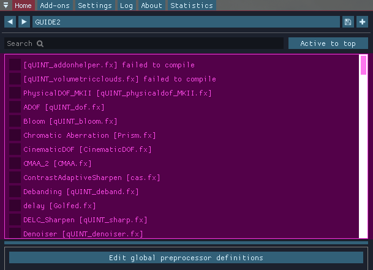
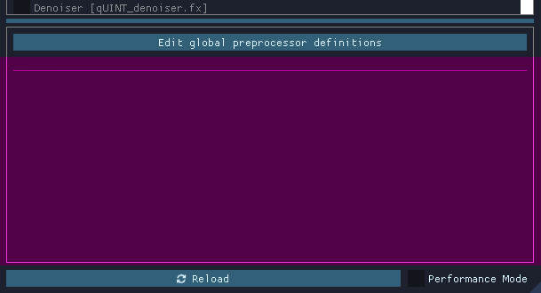
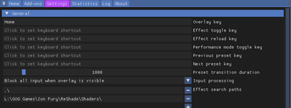
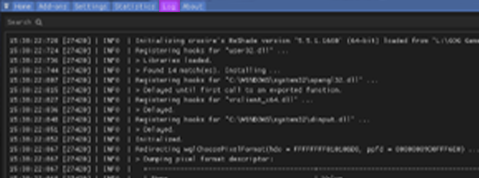

# Understanding ReShade's UI

After successfully installing ReShade, launch your game, if the ReShade popup appears at the screen's top, great! You're 70% done.

If ReShade is not appearing in your game, revisit the ReShade Installer and choose a different rendering API or executable - as a wrong selection was likely made.

To fully harness ReShade's power and utility, it is recommended to familiarize yourself with ReShade's UI.

Press the `HOME` key (or `POS1` on some keyboards depending on locale) to access the on-screen tutorial. First-timers should continue this tutorial, as it will explain the generalized basics and give you a firm foundation for what is to come! Don't skip it! 

If you have already skipped the tutorial, we will explore each feature and section within this guide together. 
A proper understanding here will seriously benefit you later, especially when diving into more advanced topics such as the Depth Buffer.

---

The Home Tab

ReShade's `Home` tab is a crucial hub, packed shaders and their valuable configurations awaiting exploration. Below you can find an explanation of each part of the `Home` tab:

Current Preset

---

The section highlighted above indicates the active preset in ReShade. By default, presets are saved in the game directory, to a file named `ReShadePreset.ini`. 

Use the `+` button on the right side of the `Home` tab to create a new preset, the diskette icon to save your preset, and arrows to switch between the current preset files within your game directory.

ReShade will smartly identify which `.ini` files are presets, ensuring seamless user experience.

---

Effect List

The highlighted segment above displays ReShade's `Effect List` within the `Home` tab. 

This section presents all of the shaders installed by the user, or the ReShade Installer. With that in mind, the list's size varies depending on the preset you've chosen and the shader repositories you set up with the ReShade Installer and other means.

---

Global Pre-processor Definitions

The above spotlight reveals the `Edit Global Preprocessor Definitions` button. Pre-Processor definitions act as toggles directing effects' behavior pre-loading.

Adjustments here can influence shader functionality or compatibility. Clicking this button unveils a small window:

The primary tab displays `Global` definitions, are applied to every preset that is enabled.

Though ReShade sets some defaults, users can add, edit, or remove them using the `+` and `-` signs. 

It is always good to know the pre-processor definition name and its range when configuring these options. Shaders often contain this info in their comments. Use advanced text editors (like [Notepad++](https://notepad-plus-plus.org/) or [Visual Studio Code](https://code.visualstudio.com/)) to examine FX files and the information within them!

The secondary tab presents pre-processor definitions for the `Current Preset`. These change or reset based on the shader's default pre-processor definitions or their global value when altering the preset. This will often come in handy when various presets require distinct pre-load settings.

{: .note}
With a default ReShade preset, the `Current Preset` tab will be blank.

---

Effect Parameters

The image above points to shaders' effect parameters. When you enable a shader in ReShade, its respective options and parameters surface here. 

Modifications that you make to these parameters will reflect in real-time. It's handy to keep the window slightly aside to observe real-time image alterations.

---

Reload Button

The emphasized `Reload` button in the image forces ReShade to revisit the files in the Shaders and Textures folder. This process appends or integrates freshly installed effects without the need to restart the game. It also reflects changes made to the shader code during its creation.

---

Performance Mode

The setting `Performance Mode` indicated in the image streamlines compilation processes and ReShade's memory operation, reducing performance burdens. However, `Performance Mode` will restrict edits to shader's parameters, and certain effects might malfunction. 

**Always** inform the shader creator about any discrepancies with Performance Mode.

---

Add-ons Tab

The designated tab in the image manages each ReShade Addons.

By default, only “Generic Depth” is pre-installed with the ReShade Installer.

Generic Depth is tasked with retrieving the depth buffer and opting for the apt one. 

We'll delve deeper soon, but remember this feature can modify each ReShade extension's behavior.

-----

Settings Tab

The identified tab in the image adjusts various pivotal ReShade settings—like directories for Shaders, keys for menu access, FPS meter configurations, theme settings, and more. 

Familiarize yourself with these options for an enhanced UI experience.

-----

Statistics Tab

The marked tab in the image illustrates performance statistics, effect utilization, consumption rates, visual appearances per pass, and more. 

Generally, this isn't a frequent stop unless you're crafting or analyzing a shader's performance.

-----

Log Tab

The highlighted tab in the image presents ReShade’s log, documenting the shader loading process and ReShade's overall operations. 

If a shader runs into issues, they'll appear here. 

* YELLOW indicates a warning (when an effect loads, but could have better, optimized code or experienced mid-load alterations).
* RED signals an error, usually with an explanatory note. 

This tool is invaluable to developers when crafting shaders.

If something seems amiss, share the error text or the log file (stored in the game directory as ReShade.log). 

However, logs are reset each game restart, so share logs before rebooting to avoid data loss.

-----

About Tab

This tab, visible in the image, credits the contributors behind ReShade's development, acknowledges licenses, and other supportive codes. 

It's a formal acknowledgment.

-----

# Understanding ReShade's Depth Buffer

The depth buffer in a game tells what in the game has “depth”, as in, what is actually 3D, and what is just a plane. 

It is the basis for effects such as Ambient Occlusion to detect what occludes and what doesn’t, and for Depth of Field to detect what is close to the camera and what isn’t. Without that, those effects don’t know what is close and far, and can’t work. 

In the next few steps, you will learn how to identify a depth buffer, how to see if it works, common issues which makes the detection not possible, and so on.

{: .warning}
> Make sure you correctly set-up ReShade and followed the previous steps on the other pages! 
> 
> This guide will be made on the basis that you followed all of the instructions there and got ReShade set-up and running correctly.

---

Depth Buffer Basics

First of all, what you need to do before anything is to know what each part and color of the Depth Buffer means, this will explain what each means, what to notice and what to do with each case.

{: .warning}
>BEFORE DOING ANYTHING THOUGH, GO TO YOUR GAME GRAPHICS SETTINGS, AND DISABLE THE FOLLOWING:
>
> * MSAA ANTIALIASING - (FXAA or TXAA is fine though, since it doesn’t erase the depth-buffer information by doing multiple samples)
> * SSAA ANTIALIASING

If it looks like the image above, the shader has loaded and is working properly, but please notice that we’re not yet done, since there are still some details wrong about what has been shown above.

{: .important}
> If your shader looks like the images below, it has no data, and you should go back a few steps and read what you should disable, carefully.
> 
> 
> 
> This is what the depth buffer shader looks like with no data.
> 
> 
> 
This is what the shader looks like when it has no data, and is reversed.

---

Global Preprocessor Basic Arguments

Dropdowns here will provide you with the basic arguments that are presented to the ReShade Depth Buffer.

---

RESHADE_DEPTH_INPUT_IS_REVERSED

Used when you can see the normals, but can’t see the depth image itself (The first result image should represent this perfectly), usually starts at 1 so set it to 0 to fix it, it can also be the other way around.

---

RESHADE_DEPTH_INPUT_IS_UPSIDE_DOWN

As the name says, when the image shown by the DisplayDepth shader is upside down, setting it to 1 should fix the issue.

---

RESHADE_DEPTH_INPUT_IS_LOGARITHMIC

Used when the depth buffer has lots of waves or “stripes”. Very FEW games actually do use this, so you rarely will have to switch or change that.

---

Global Preprocessor Advanced Arguments

These more advanced options here will rarely need to be changed, but for old games or emulators, you might have to fiddle around with them.

Here you can find a generalized description of them.

---

RESHADE_DEPTH_INPUT_X_SCALE | RESHADE_DEPTH_INPUT_Y_SCALE

Changes the depth buffer size (multiplier, so 1 = original size, 2 = double and so on) on the horizontal (X) and vertical (Y) axis.

---

RESHADE_DEPTH_LINEARIZATION_FAR_PLANE

How far is the “infinite” defined in the depth buffer. 

Values can either be really low or really high, so you will have to experiment to see which fits best on your case.

---

RESHADE_DEPTH_MULTIPLIER

Multiplies the far plane for easy visualization of really low or really high far plane values.

