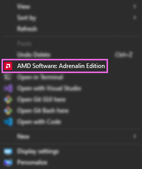
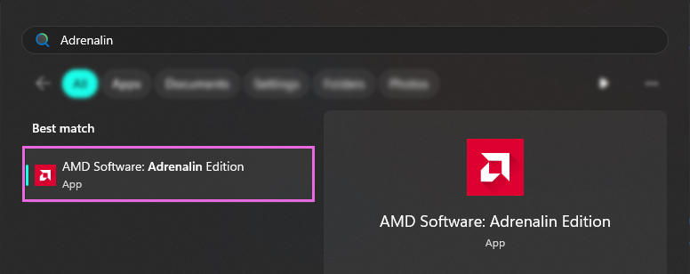
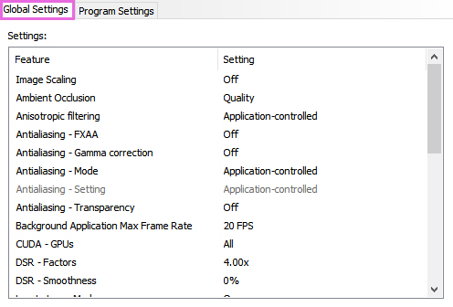
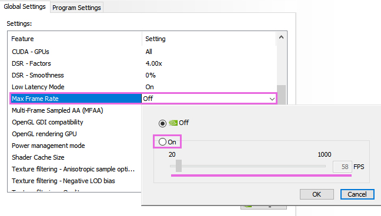
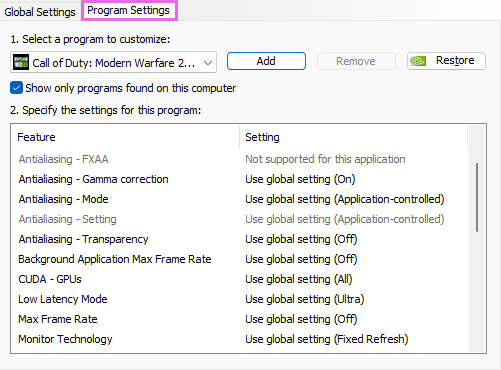
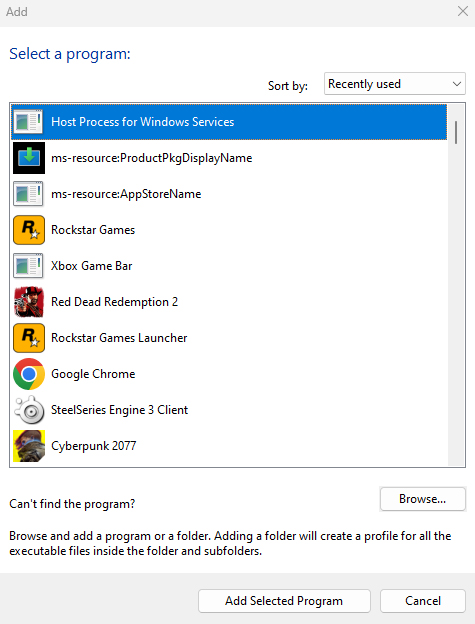
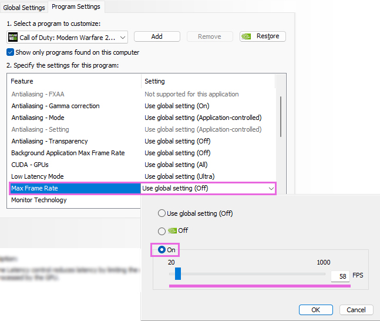

# Limiting Your Game's Framerate

A high FPS (Frames Per Second) can sometimes prevent shaders in ReShade from functioning optimally. 

This guide offers multiple methods to help you limit your game's framerate.

---

AMD Adrenalin | Driver-Based (For AMD GPU only, Affects All Games)

Here's how you can use AMD Adrenalin's `Frame rate target control` feature to limit the FPS of your games:

{: .warning}
This impacts all games on your system.

---

### Step 1: Access Adrenalin

- **Easiest Method**: Right-click your desktop and select `AMD Software: Adrenalin Edition`.
  
  
- **Alternative**: Search for `Adrenalin` in the Windows Search Bar.
  

---

### Step 2: Activate "Frame rate target control"

1. Click on `Gaming` in the top bar and select `Graphics`.
   
2. In the `Graphics` tab, go to the `Advanced` section and enable `Frame rate target control`.
   
3. Adjust the `Max FPS` as per your preference.
   

---

NVIDIA Control Panel | Driver-Based (For NVIDIA GPU only, Affects All Games)

Here's how to use NVIDIA's Control Panel in order to globally limit the FPS of all your games:

{: .warning}
This impacts all games on your system.

---

### Step 1: Access NVIDIA Control Panel

- **Easiest Method**: Right-click your desktop and select `NVIDIA Control Panel`.
  
  
- **Alternative**: Search for `NVIDIA Control Panel` in the Windows Search Bar.
  

---

### Step 2: Modify 3D Global Settings

1. On the left, click `Manage 3D Settings`.
   
2. Switch to the `Global Settings` tab.
   
3. Activate `Max Frame Rate` and select a value between 20 and 1000.
   

---

NVIDIA Control Panel | Driver-Based (For NVIDIA GPU only, Specific Games)

Here's how to use NVIDIA's Control Panel in order to globally limit the FPS to specific games:

---

### Step 1: Access NVIDIA Control Panel

- **Easiest Method**: Right-click your desktop and choose `NVIDIA Control Panel`.
  
  
- **Alternative**: Search for `NVIDIA Control Panel` in the Windows Search Bar.
  

---

### Step 2: Modify Per-Game 3D Settings

1. On the left, click `Manage 3D Settings`.
   
2. Navigate to the `Program Settings` tab.
   
3. Click `Add` to the right of `Program to customize:`.
   
4. Choose the game you want to limit.
   
5. Enable `Max Frame Rate` and choose a value between 20 and 1000.
   

