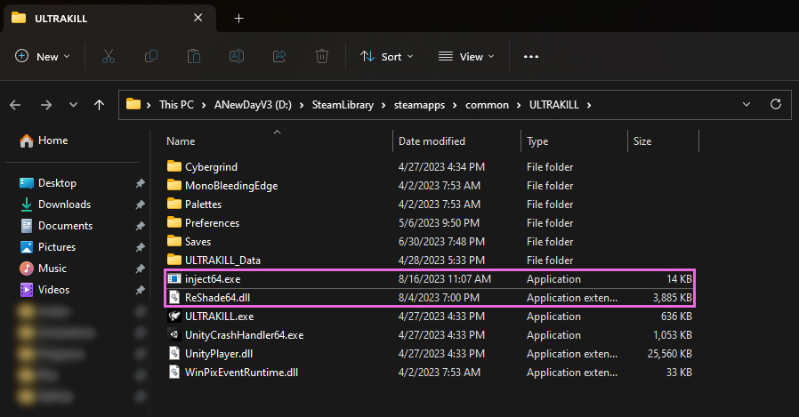
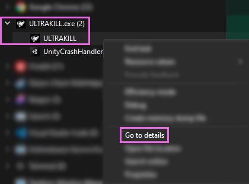

# ReShade Manual Installation Guides

Some games might not support direct installation through the ReShade Installer due to permission constraints, administrative prompts, or even missing user dependencies.

This guide aims to help users understand and navigate the process of manual installation, ensuring they can seamlessly integrate ReShade into their desired game.

---

Installing ReShade Manually

## Step 1: Identify Your Game's Architecture

1. Navigate to [PCGamingWiki](https://www.pcgamingwiki.com/wiki/Home).
2. Use the search bar to find your game.
   
3. Locate the API tab on your game's page, typically towards the end.
   

---
 
## Step 2: Obtain ReShade Installer

- Download the latest ReShade installer from the [official ReShade website](https://reshade.me).

---

## Step 3: Get `7Zip`

1. Download and install the latest `.msi` version of `7Zip` from [7Zip's official website](https://www.7-zip.org/download.html).
   

   {: .note} 
   While WinRar can be an alternative, this guide focuses on using `7Zip`.

---
 
## Step 4: Extract ReShade Binary

1. Right-click on the ReShade Installer `ReShade_Setup_x.x.x.exe`, hover over `7Zip`, and select `Open Archive`.
   
2. Choose the necessary DLL from the options:
   - `ReShade64.dll` for 64-Bit
   - `ReShade32.dll` for 32-Bit
   

---
 
## Step 5: Rename the Binary

Right-click the `ReShadeXX.dll` you've extracted and choose `Rename`. Then, rename it according to your game's rendering API:

- dxgi.dll - DirectX 10/11/12
- d3d12.dll - DirectX 12
- d3d11.dll - DirectX 11
- d3d10.dll - DirectX 10
- d3d9.dll - DirectX 9
- opengl32.dll - OpenGL

---
 
## Step 6: Move the Renamed DLL

1. Position the renamed DLL into the root folder of your game, the same directory where the game's executable is located.
   
2. If unsure of your game's executable location, consult [our guide on identifying your game's executable](https://guides.martysmods.com/docs/special_other/finding_your_game_executable.html).

Upon completion, your game should launch with ReShade already integrated!

------

How to Manually Inject ReShade

Certain games do not support automatic ReShade injection during runtime. 
This is especially common for UWP (Microsoft Store) games, which often disallow automatic injection. 

Thankfully, Crosire has developed a tool for manual DLL injection into games.

{: .warning} 
Crosire's Inject tool, being an external injector, is more likely to trigger anti-cheat systems. **Use with caution and at your own risk**.

## Step 1: Determine Your Game's Architecture

1. Go to [PCGamingWiki](https://www.pcgamingwiki.com/wiki/Home).
2. Enter your game's name in the search bar.
   
3. Proceed to the API section on your game's page (usually located towards the end).
   

---

## Step 2: Download the Right Injector

Choose the injector based on your game's architecture:
* [64-bit Injector](https://reshade.me/downloads/inject64.exe)
* [32-bit Injector](https://reshade.me/downloads/inject32.exe)

---

## Step 3: Download ReShade Installer

Acquire the latest ReShade Installer from the [ReShade website](https://www.reshade.me).

---

## Step 4: Get `7Zip`

1. Download and install the latest `.msi` version from [7Zip's official website](https://www.7-zip.org/download.html).
   

{: .note} 
`WinRar` can serve as an alternative, but this guide utilizes `7Zip`.

---

## Step 5: Extract ReShade Binary

1. Right-click the ReShade Installer `ReShade_Setup_x.x.x.exe`, hover over `7Zip`, and select `Open Archive`.
   
2. Extract the desired DLL:
   - `ReShade64.dll` for 64-Bit
   - `ReShade32.dll` for 32-Bit
   

{: .note}
The DLL architecture should match the injector you've previously downloaded.

---

## Step 6: Position the Files

Move both the `injectXX.exe` and `ReShadeXX.dll` files to your game directory.

For assistance locating your game directory, see [our guide on finding your game's executable](https://guides.martysmods.com/docs/special_other/finding_your_game_executable.html).

---

## Step 7: Identify the Game Process Name

1. Launch the desired game.
2. Open Task Manager and right-click on your game under the processes tab, then select `Go to Details`.
   
3. The highlighted executable displays the game's process name.
   

---

## Step 8: Inject ReShade

1. Close your game.
2. Navigate to your game's directory and open a command prompt by typing `CMD` into File Explorer's address bar.
   
3. Input `inject[x32/x64].exe "name_of_the_process.exe"` and hit Enter.
   
4. Open your game.

If executed correctly, ReShade should be active once the game begins.

